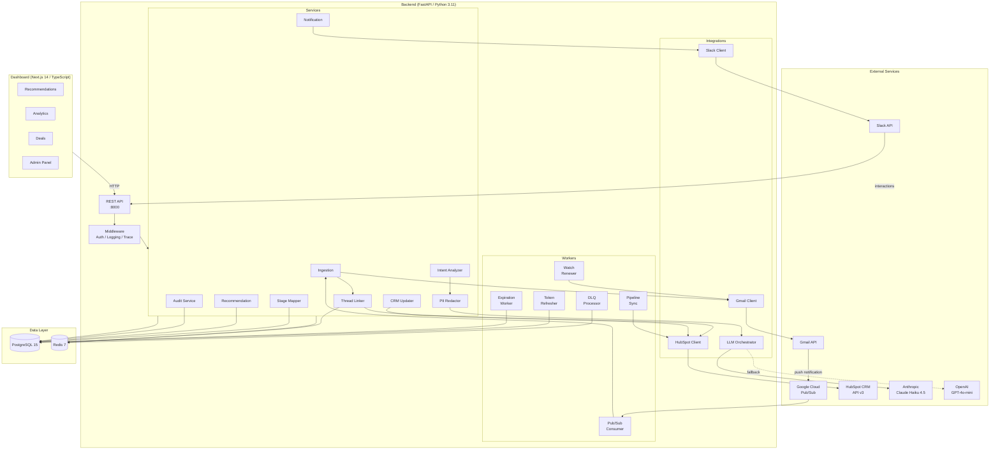
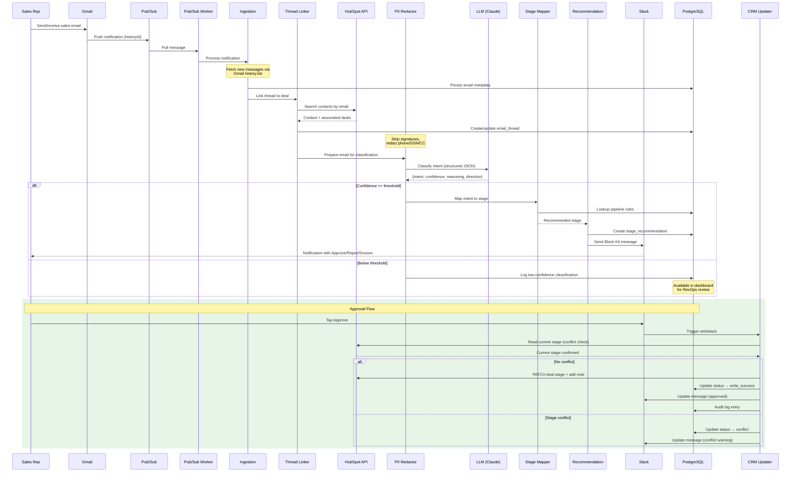
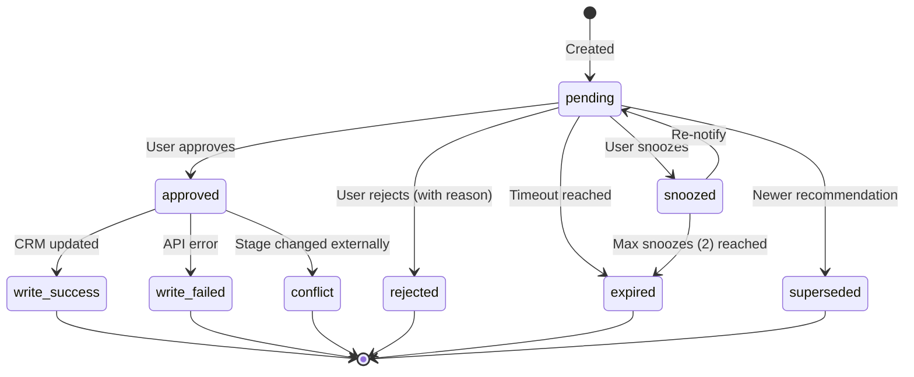
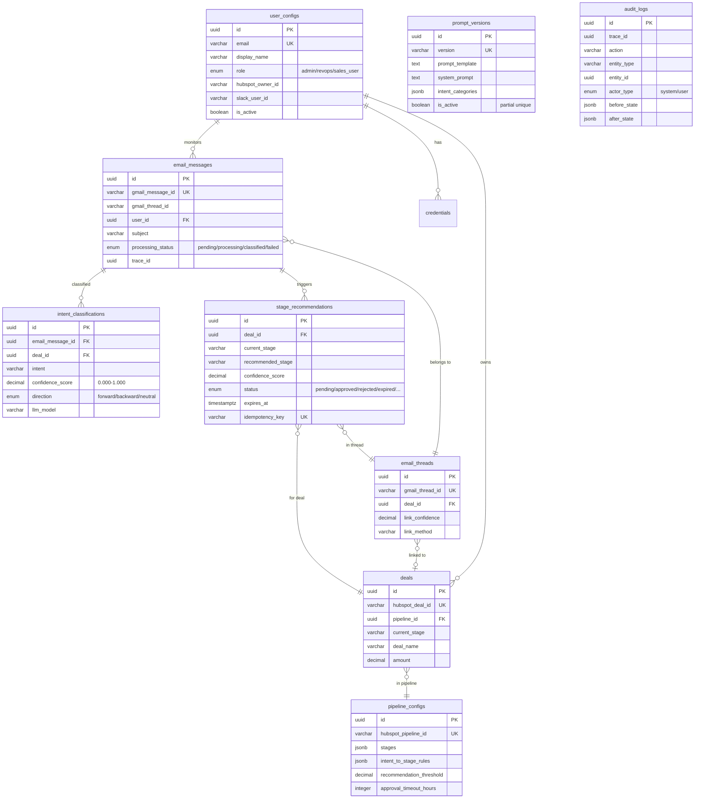

# HubSpot Pipeline Intelligence

An intelligence layer that monitors sales emails via Gmail push notifications, classifies deal-progression signals using LLM-based intent analysis, generates human-reviewed stage recommendations delivered via Slack, and writes approved changes back to HubSpot CRM.

## Architecture



## Pipeline Flow



## Recommendation State Machine



## Data Model



## How It Works

1. **Email Monitoring** - Gmail push notifications detect new sales emails via Pub/Sub
2. **Thread Linking** - Emails are matched to HubSpot deals through contact resolution
3. **Intent Classification** - Claude Haiku 4.5 classifies the email's deal-progression intent (e.g., pricing discussion, contract negotiation, technical evaluation)
4. **Recommendation** - If confidence exceeds the threshold, a stage change recommendation is generated
5. **Slack Notification** - Sales reps receive an interactive Slack message with Approve/Reject/Snooze buttons
6. **CRM Writeback** - Approved recommendations update the deal stage in HubSpot with audit notes
7. **Dashboard** - RevOps can monitor recommendations, view analytics, and manage configuration

## Tech Stack

| Component | Technology |
|-----------|-----------|
| Backend API | Python 3.11+, FastAPI, SQLAlchemy 2.0, Alembic |
| Dashboard | Next.js 14, TypeScript 5.x, Tailwind CSS 3.x |
| Database | PostgreSQL 15+ |
| Cache/Queue | Redis 7+ |
| LLM (primary) | Anthropic Claude Haiku 4.5 |
| LLM (fallback) | OpenAI GPT-4o-mini |
| Email | Gmail API + Google Cloud Pub/Sub |
| CRM | HubSpot API v3 |
| Notifications | Slack Block Kit |
| Metrics | Prometheus |
| Deployment | Docker, GCP Cloud Run |

## Project Structure

```
backend/
├── app/
│   ├── main.py                 # FastAPI entry point
│   ├── config.py               # Settings (env/DB/defaults)
│   ├── dependencies.py         # DI container
│   ├── api/
│   │   ├── routes/             # REST endpoints
│   │   │   ├── recommendations.py
│   │   │   ├── deals.py
│   │   │   ├── analytics.py
│   │   │   ├── admin.py
│   │   │   ├── auth.py
│   │   │   ├── slack_interactions.py
│   │   │   ├── audit.py
│   │   │   └── health.py
│   │   └── middleware/         # Auth, logging, tracing
│   ├── services/               # Business logic
│   ├── integrations/           # Gmail, HubSpot, LLM, Slack clients
│   ├── models/                 # SQLAlchemy ORM models
│   ├── workers/                # Background workers
│   └── utils/                  # Encryption, rate limiter, circuit breaker
├── alembic/                    # Database migrations
├── Dockerfile
└── pyproject.toml

dashboard/
├── src/
│   ├── app/
│   │   └── dashboard/
│   │       ├── recommendations/ # Recommendation list & detail
│   │       ├── analytics/       # KPI dashboard
│   │       ├── deals/           # Deal overview
│   │       └── admin/           # Users, pipelines, prompts, thresholds, health
│   ├── lib/                     # API client, auth
│   └── types/                   # Shared TypeScript types
├── Dockerfile
└── package.json

infra/
└── docker-compose.yml           # PostgreSQL, Redis, backend, dashboard, workers
```

## Getting Started

### Prerequisites

- Python 3.11+
- Node.js 20+ and npm
- Docker and Docker Compose

### 1. Start Infrastructure

```bash
cd infra
docker compose up -d postgres redis
```

### 2. Backend Setup

```bash
cd backend
python -m venv .venv
source .venv/bin/activate
pip install -e ".[dev]"

cp .env.example .env
# Edit .env with your credentials

alembic upgrade head
python -m app.scripts.seed
uvicorn app.main:app --reload --port 8000
```

API available at `http://localhost:8000` (docs at `/docs`).

### 3. Dashboard Setup

```bash
cd dashboard
npm install

cp .env.example .env.local
# Set NEXT_PUBLIC_API_URL=http://localhost:8000/api/v1

npm run dev
```

Dashboard available at `http://localhost:3000`.

### 4. Start Workers

```bash
cd backend
python -m app.workers.pubsub_consumer &
```

### 5. Run with Docker Compose (all services)

```bash
cd infra
docker compose up --build
```

## External Services Setup

| Service | What's Needed |
|---------|--------------|
| **Gmail** | GCP OAuth Client ID, Gmail API enabled, Pub/Sub topic `gmail-push-notifications` |
| **HubSpot** | Private app token with deal/contact/owner read+write scopes |
| **Slack** | Bot token (`chat:write`, `users:read`), signing secret, interaction URL |
| **Anthropic** | API key for Claude Haiku 4.5 |
| **OpenAI** | API key for GPT-4o-mini (fallback) |

See `backend/.env.example` for all required environment variables.

## Key Endpoints

| Method | Path | Description |
|--------|------|-------------|
| GET | `/api/v1/health` | System health check |
| GET | `/api/v1/recommendations` | List recommendations (paginated, filterable) |
| POST | `/api/v1/recommendations/{id}/approve` | Approve a recommendation |
| POST | `/api/v1/recommendations/{id}/reject` | Reject with reason |
| GET | `/api/v1/deals` | List deals |
| GET | `/api/v1/analytics/overview` | Analytics KPIs |
| GET | `/api/v1/admin/users` | List users (admin) |
| GET | `/api/v1/admin/pipelines` | Pipeline configuration (admin) |
| GET | `/api/v1/admin/prompts` | Prompt versions (admin) |
| POST | `/api/v1/slack/interactions` | Slack webhook handler |
| GET | `/api/v1/metrics` | Prometheus metrics |

## Performance Targets

| Metric | Target |
|--------|--------|
| Email to Slack notification (p50) | < 60s |
| Email to Slack notification (p95) | < 120s |
| Approval to CRM write (p50) | < 3s |
| Approval to CRM write (p95) | < 10s |

## Architecture Principles

| Principle | Implementation |
|-----------|---------------|
| **Human-in-the-loop** | All CRM writes require explicit user approval; no auto-approve path exists |
| **Privacy by design** | No email body storage; PII redacted before LLM processing (phone, SSN, CC stripped) |
| **Resilience** | Per-integration circuit breakers, exponential backoff with jitter, Redis DLQ with DB overflow |
| **Audit trail** | Immutable INSERT-only audit log for every state transition with trace_id correlation |
| **LLM failover** | Primary (Claude Haiku 4.5) with automatic fallback to GPT-4o-mini on circuit break |
| **Configurable** | Thresholds, prompts, intent mappings, and timeouts adjustable via admin dashboard |
| **Observability** | Structured JSON logs (structlog), Prometheus metrics, Slack alerting for DLQ/errors |
| **Security** | AES-256 encrypted tokens, Google OIDC SSO, RBAC (admin/revops/sales_user), Slack signature verification |

## Running Tests

```bash
# Backend
cd backend
pytest tests/unit -v --cov=app

# Dashboard
cd dashboard
npm test
```

## License

Proprietary - Internal use only.
